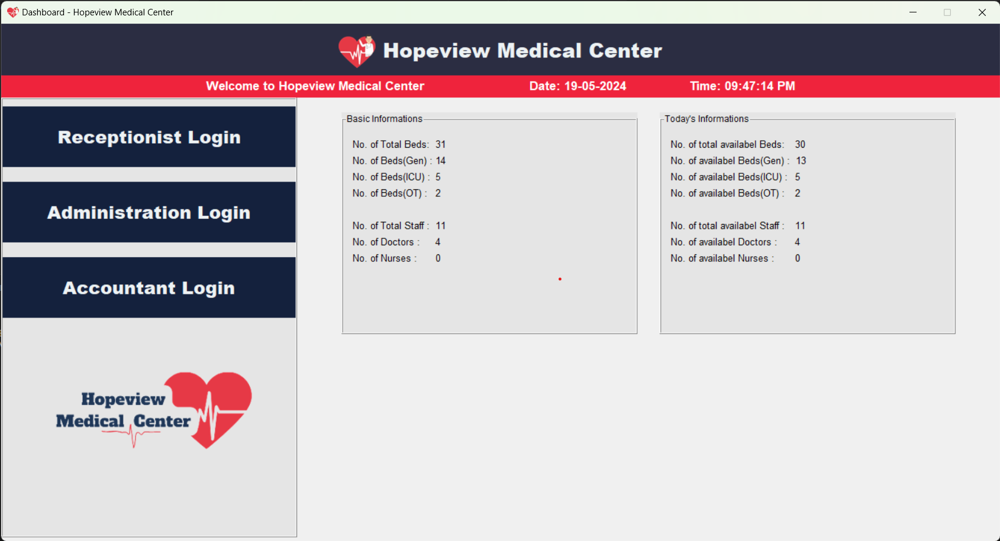
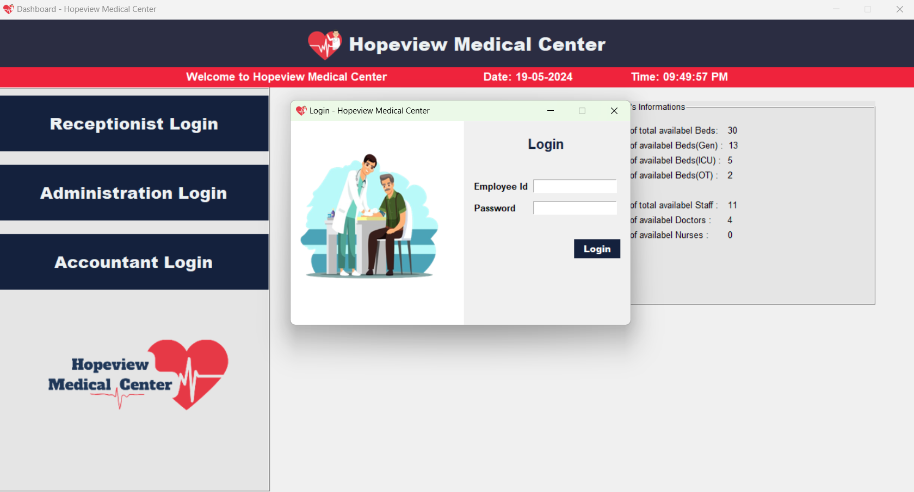
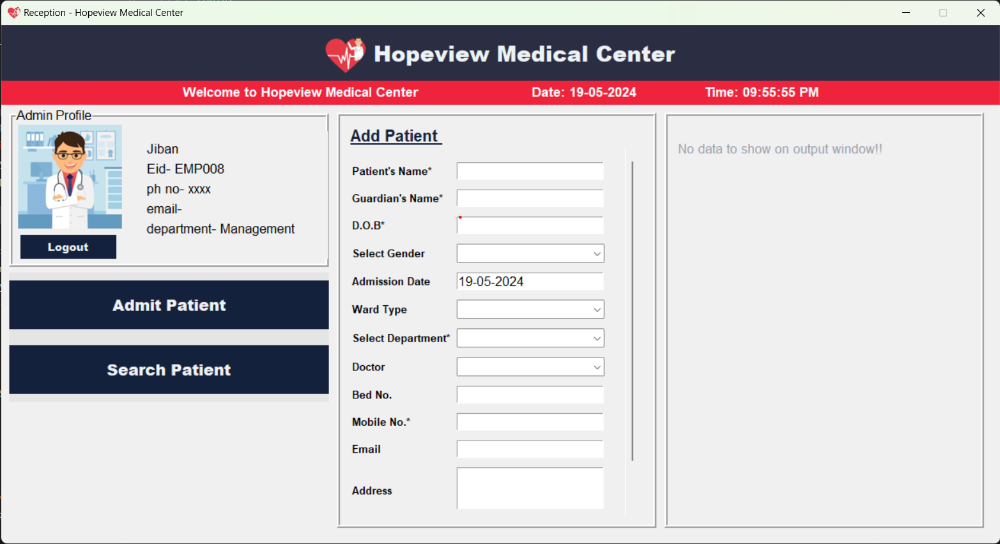
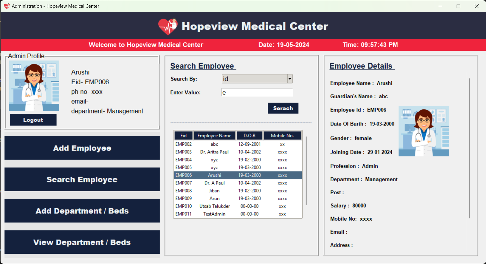
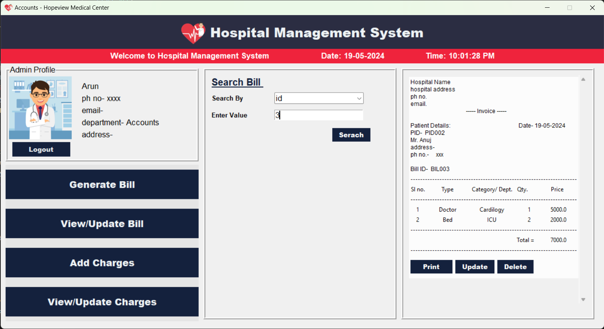

Hospital Management System

features-
- Patient Management for efficient record keeping
- Staff & Department Management for streamlined operations.
- Comprehensive Billing System with print functionality for easy record access.

*Note: The project is not compatible with Linux, you may face some issues if try to run on Linux.

## Steps to run the project properly

- clone the repositery
```bash
    git clone https://github.com/Aritra212/Hospital-Management-System.git
```
- run the file [create_db.py](./create_db.py) to create the database
  
```bash
    python create_db.py
```
- run the file [main.py](./main.py)

```bash
    python main.py
```

## Some screenshots of the project

- ### Dashboard

  

- ### Login window

  

- ### Reception window

  

- ### Admin window

  

- ### Accounts window

  
